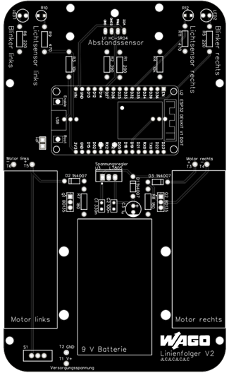
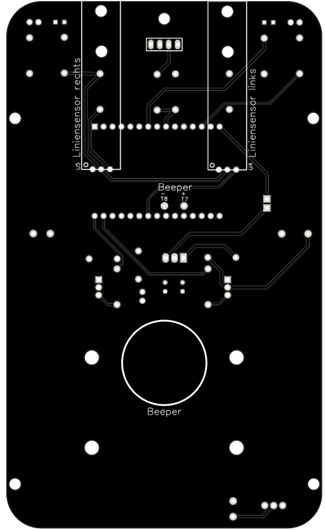

## Aufbauanleitung
Diese Anleitung soll dich durch den gesamten Aufbauprozess des Roboters führen. Damit dieser möglichst geordnet abläuft solltest du auch hier zunächst prüfen, ob [du alle Bauteile hast](Material.pdf).
### Löten

{: .alert}
Bevor du mit dem Löten startest wende dich an einen [Betreuer](./index.html/#ansprechpartner), damit wir dir eine kurze Einführung und Sicherheitseinweisung zum Löten erteilen können.

|Vorderseite|Rückseite|
|:---------:|:-------:|
|||

Das ist die Platine des Linienroboters. Jede weiß umrandete Fläche steht für ein eigenes Bauteil, welches auf der Platine angelötet werden soll. Die Markierungen einzelner Bauteile entsprechen auch den Markierungen auf der Platine, also muss z.B. die LED auch entsprechend der Kerbe auf der Platine angeordnet werden.

{: .info}
Beim Löten empfiehlt es sich, nicht direkt alle Bauteile anzulöten, sondern nach deren Größe sortiert. Sonst könnten kleinere Bauteile wieder herausrutschen, wenn man die Platine umdreht.

Am besten geht man nach folgender Schritt-für-Schritt-Anleitung vor:

1. Widerstände und Dioden
   + Biege die Anschlussdrähte zunächst zu den Löchern auf der Platine passend
   + Achte bei den Dioden auf jeden Fall darauf, dass sie richtig gepolt eingebaut werden - der Ring auf der Diode muss mit dem auf der Platine übereinstimmen
   + Die Widerstände müssen vorher mit einem Multimeter geprüft werden
2. Kondensatoren C1 & C2
   + Auch hier ist die Einbaurichtung entscheidend
   + Das auf des Bauteil gedruckte `+` muss in Fahrtrichtung zeigend eingebaut werden
3. Batteriehalter
   + Roter Anschlussdraht an `+`, schwarzer an `GND`
4. LEDs
   + Entsprechend der auf der Platine angezeigten Polung
5. Schalter S1
6. Beeper
   + Rot an `+`, schwarz an `-`
   + Klebe den Beeper später mit Klebeband an der Platine fest
7. Liniensensoren
   + Schneide die 3-er Leitungsbrücken in der Mitte durch und isoliere sie etwas ab
   + Die Metallstifte des Sensors werden nachher übereinstimmend mit den Lötstellen angeschlossen. Löte die Kabel also in einer beliebigen Reihenfolge an
   + Wenn du alles fertig gelötet hast, kannst du die Liniensensoren mit den mittleren Abstandshaltern an der Platine anbringen
8. Buchsenleisten
   + Löte diese auf jeden Fall parallel zueinander an, damit der ESP32 nachher problemlos montiert werden kann
9. Kondensator C3
10. 2-Pol-Steckerleiste (Jumper)
    + Die kurzen Enden müssen auf die Platine gelötet werden
11. Transistoren
    + Die beschriftete (Vorder-)seite des Transistors muss in Richtung des Punktes auf der Platine weisen
12. Fotowiderstände R10 & R12
    + Lasse sie etwas überstehen
13. Spannungswandler
    + Auch hier muss die Vorderseite wieder dem Punkt zugewandt sein
14. Motoren
    + Löte je ein rotes und ein schwarzes Kabel an die Platine
    + Um die Drehrichtung des Motors noch ändern zu können löte die Kabel erst nach den ersten Tests am Motor an

### Aufbau
+ Baue die Liniensensoren an (s.O.)
+ Baue mit dem längeren Abstandshalter die 3D-Kugel an. Achte dabei darauf, dass der Abstandhalter die passende Gewindestärke hat
+ Befestige die Motoren und die Batterie mit Kabelbindern am Roboter
+ Stecke den ESP32 auf die 15-poligen Buchsenleisten
+ Bestfestige die Räder an den Motoren
+ Stecke den Abstandssensor in die vordere Buchsenleiste

|            |            |
|:-----------|-----------:|
|<a href="./Einfuehrung.html"><- Einführung</a>|<a href="Linie-folgen.html">Linie folgen -></a>|
