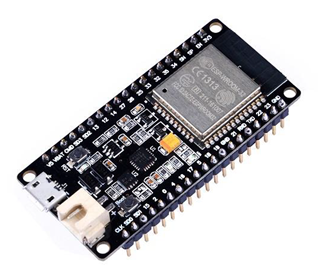
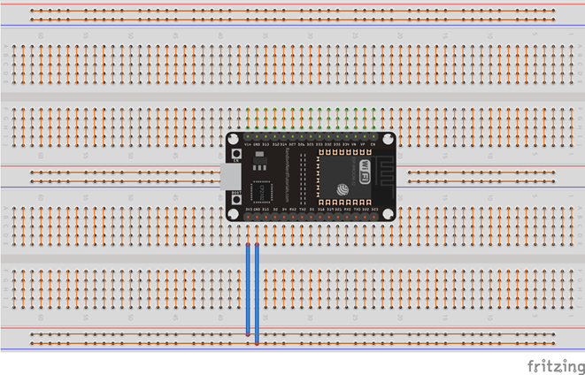
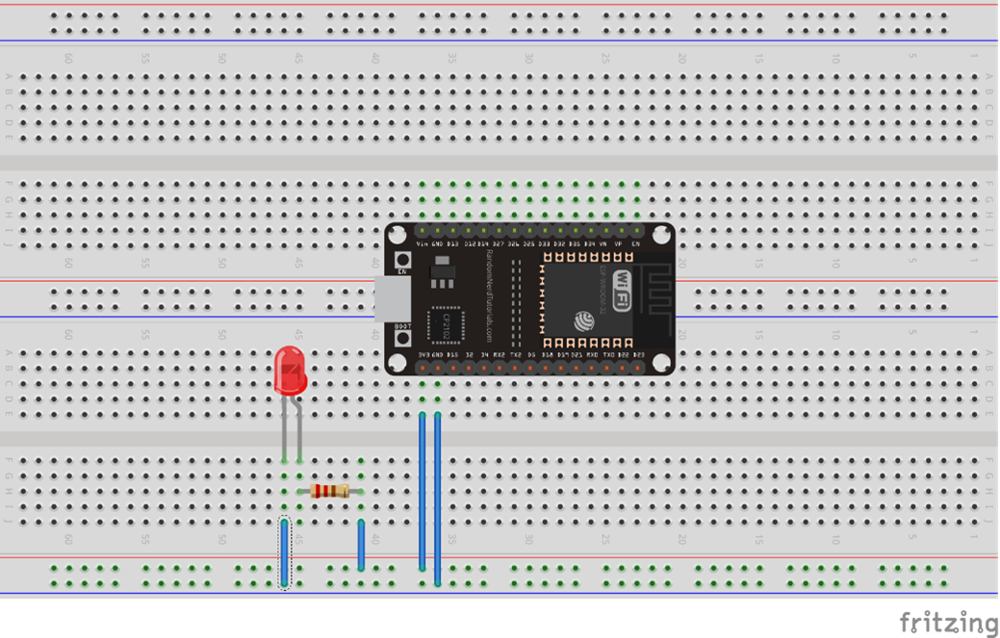
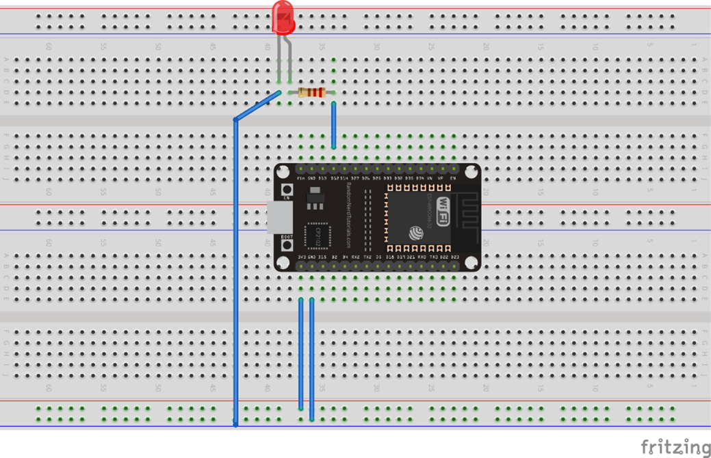
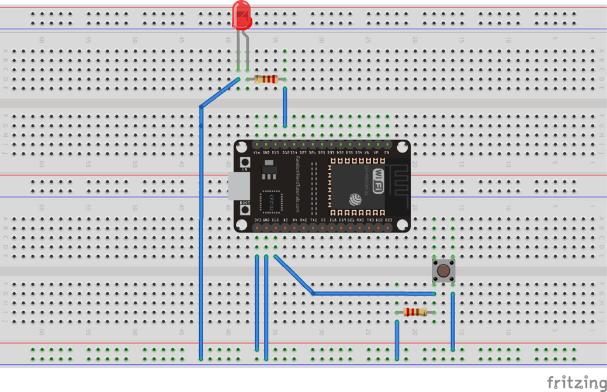
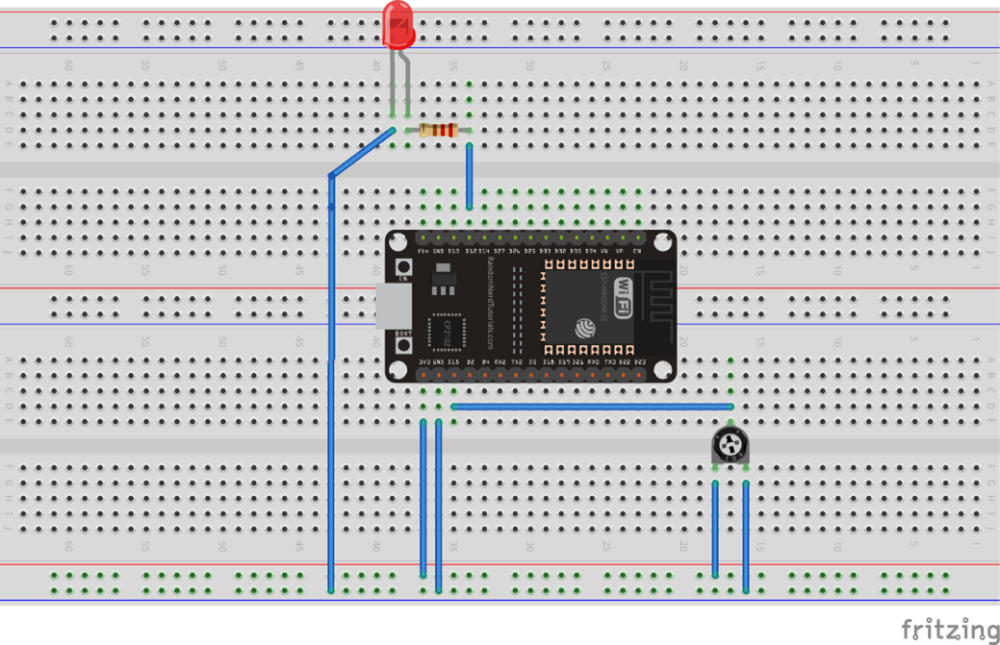
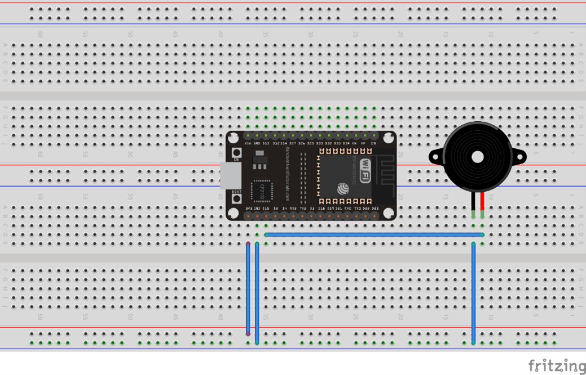

## Einführung

In der Einführung sollst du dich zunächst mit der Arduino IDE und dem ESP 32 vertraut machen sowie elektro- und informationstechnische Grundlagen erlernen, um später den Linienroboter problemlos aufbauen zu können.
Zuerst solltest du mithilfe der [Materialliste](Material.pdf) alle nötigen Bauteile zusammensuchen. Die Bauteile für diese Einleitung sind nicht in dem Bauteilsatz für den Linienroboter enthalten. Bei der Durchführung der Einführung können dir [dieses Diagramm von den Pins des ESP32](00-Pinout-ESP32-DEVKIT-V1.pdf) und [dieser Arduino Cheat Sheet](00-CheatSheet-Arduino.pdf) helfen.

{: .info}
Diese und die kommenden Anleitungen sollen dich bei deinem Praktikum unterstützen. Falls es zwischendurch Fragen geben sollte oder du anhand der Anleitung nicht weiterkommst, kannst du uns jederzeit [ansprechen](./index.md/#ansprechpartner)!

### Grundsätzliches
Wir beginnen mit dem Mikrocontroller, der den Roboter am Ende steuern wird. Das ist ein ESP32-Entwicklungsboard.



Der eigentliche Mikrocontroller ist das silberne Quadrat in der oberen Hälfte. Der Rest sind bspw. eine WLAN-Antenne und die Stromversorgung des Mikrocontroller. Solche Mikrocontroller können z.B. für die Auswertung von Sensordaten, die Datenaufnahme oder kleinere Berechnungen eingesetzt werden.
Die Metallstifte an der Seite sind die Anschlüsse für verschiedene Schnittstellen, die der Mikrocontroller unterstützt. Wir nennen sie „Pins“. Welcher Metallstift welche Schnittstelle [unterstützt](00-Pinout-ESP32-DEVKIT-V1.pdf) unterscheidet sich, je nachdem welches Entwicklungsboard man verwendet. Wenn du also selbst zu Hause mit einem ESP32-Board arbeiten möchtest, musst du immer die passende Pin-Belegung („Pinout“) suchen.
Im Praktikum wird vorgegeben, welcher Pin verwendet werden soll.
Der ESP32 kann über verschiedene sogenannte Bus-Schnittstellen kommunizieren, die für uns aber nicht relevant sind. Wir nutzen vor allem die **GPIOs**. Das steht für **G**eneral **P**urpose **I**nput **O**utput, also allgemeine Eingabe und Ausgabe.
Eingaben sind z.B. Werte, die Sensoren aufnehmen und die wir im Programm verarbeiten, Ausgaben sind Signale, um bspw. die Motoren ein- und auszuschalten.

### Aufgabe 1
Wir starten mit einem sogenannten „Hello World“ Programm.
Das ist immer ein möglichst einfaches Programm ohne große Funktionalität, mit dem erst einmal nur getestet wird, ob die Verbindung zu dem Gerät bzw. das Gerät selbst funktioniert. Dafür muss die Arduino IDE aus dem Ordner „arduino-1.8.13-windows-portable“ gestartet werden. Dann öffnet sich ein leeres Projekt, dass aus zwei Funktionen besteht. Diese beiden Funktionen sind immer der Grund-Bestandteil aller Projeke:
+	_setup()_: Diese Funktion wird beim Starten des ESP32 einmalig ausgeführt und wird genutzt, um die Ein- und Ausgänge den Anschluss-Pins des ESP32 zuzuordnen oder eine Verbindung zu initialisieren.

+	_loop()_: Diese Funktion wird solange das Board eingeschaltet ist wiederholt und zum Abfragen bzw. Beschalten der Ein- und Ausgänge genutzt.
Schreiben Sie zunächst diesen Programm-Code in die Funktionen:

```C
void setup() {
   Serial.begin(9600);
}
  
void loop() {
   Serial.println("Hello World");
   delay(2000);
}
```
#### Verbindung zum ESP32 herstellen
Verbinde den ESP32 mit einem microUSB-Kabel mit einem PC. Das passende ESP32-Board (ESP32 DOIT DEVKIT V1) ist in dieser Version der Arduino IDE schon vor-ausgewählt. Stelle als nächstes den Verbindungsport ein. Unter „Werkzeuge > Ports“ werden die möglichen Ports angezeigt. Jetzt kann das Programm in der Arduino IDE kompiliert und auf den ESP32 geladen werden. Dafür muss das Pfeil-Symbol oben links betätigt werden.
Wenn das Hochladen abgeschlossen ist, lässt sich über _Werkzeuge > Serieller Monitor_ ein weiteres Fenster öffnen, in dem alle 2 Sekunden der Text „Hello World“ ausgegeben wird. Die Kommunikation zwischen dem ESP32 und dem PC funktioniert also.
Dieses neu-geöffnete Fenster ist der Serielle Monitor. Über die Code-Zeile `Serial.begin(9600)` wird eine Verbindung dazu aufgebaut und mit `Serial.println("Hello World")` können dann Text-Zeilen ausgegeben werden. Das kann später, z.B. für Kontroll-Ausgaben, verwendet werden. Falls die Ausgaben nicht menschenlesbar sind, sollte sichergestellt werden, dass die **Baudraten** von Code und seriellem Monitor übereinstimmen.

### Aufgabe 2
#### Das Steckbrett
Die Folgenden Aufgaben werden alle auf einem sogenannten **Steckbrett** oder englisch Breadboard durchgeführt.
Um dieses richtig verwenden zu können, ist es wichtig, zu wissen, wie dieses verbunden ist. Die folgende Grafik stellt innenliegende Brücken anhand orangefarbener Linien dar. Um die folgenden Übungen durchführen zu können, sollte der ESP32 wie abgebildet auf das Board gesteckt werden.



#### LEDs
In dieser Aufgabe soll die **LED** (_Light emitting diod_) oder Leuchtdiode eingeführt werden. 
Wenn durch eine LED Strom fließt, leuchtet sie. Ist der Strom durch die LED zu groß, brennt sie durch. Um das zu verhindern muss immer ein sogenannter Vorwiderstand zwischen der Stromquelle und der LED („vor der LED“) eingebaut werden. Für die folgenden Aufgaben soll immer ein Widerstand von 220 &#8486; verwendet werden.
Wenn du dir die LED genau ansiehst, fällt dir auf, dass sie nicht symmetrisch aufgebaut ist, sondern einer der Anschlussdrähte länger ist. Der lange Anschlussdraht ist der Plus-Pol der LED, der kurze der Minus-Pol. An dieser Seite ist auch das Gehäuse der LED abgeflacht, auch daran lassen sich die Seiten unterscheiden.
Der Strom soll mit dem langen Bein, also dem Plus-Pol verbunden sein.
Baue nun die Schaltung entsprechend des folgenden Bildes auf:



Leuchtet die LED? - Was passiert, wenn man sie umdreht?

### Aufgabe 3
Mit dem Aufbau der vorherigen Aufgabe liegt immer Spannung an der LED an und sie leuchtet immer.
Wir wollen sie aber selbst über den Mikrocontroller ein- und ausschalten können. Dafür nutzen wir einen Ausgangspin des ESP32, den wir programmieren können. Baue dafür als erstes diese Schaltung auf und öffne ein neues Projekt in der Arduino IDE:



Der Ausgang, an dem der Widerstand angeschlossen ist, ist mit „D12“ bezeichnet. Das ist der Pin mit der Nummer 12. Damit wir nicht im Programm die Nummer verwenden müssen, um die LED ansteuern zu können, „merken“ wir uns den Pin und definieren dafür eine eigene Bezeichnung. Das macht man durch `#define <Platzhalter> <Wert>`, dass man über die Loop- und Setup-Funktion schreibt. In diesem Fall also:

```C
#define LED 12
```
Jetzt müssen wir noch konfigurieren, dass dieser Pin als Ausgang genutzt werden soll. Das muss nur einmal beim Starten des ESP ausgeführt werden und wird daher in die _Setup()_-Funktion geschrieben. Die Funktion, um einen digitalen Ein- oder Ausgang zu konfigurieren ist `pinMode(<Pin>, <INPUT/OUTPUT>)`.
Für alle Stellen im Programm, in denen die Pin Nummer benötigt wird, können wir jetzt den Platzhalter eintragen, also:
```C
pinMode(LED, OUTPUT);
```
Damit „weiß“ das Programm, dass dieser Pin, an den die LED über den Vorwiderstand angeschlossen ist, einen Wert High/Low ausgeben soll. Das müssen wir im nächsten Schritt auf diesen Pin schreiben. Das soll immer wieder passieren, muss also in die loop()-Funktion geschrieben werden.
Ein digitaler Wert hat immer zwei Zustände: 0 und 1 bzw. true/false, HIGH/LOW.
Um einen Ausgang ein- oder auszuschalten, muss die Funktion `digitalWrite(LED, HIGH);` aufgerufen werden.
Mit HIGH wird die LED eingeschaltet. Um sie wieder auszuschalten, schreibt man LOW statt HIGH. Eine blinkende LED schaltet sich in festgelegten Abständen immer wieder an und aus. Um diesen Abstand zu programmieren, nutzt man `delay(<Zeit in Millisekunden>);`
Schreibe nun ein Programm, welches anhand der nun bekannte Funktionen die LED alle 2 Sekunden für 2 Sekunden blinken lässt.

### Aufgabe 4
Bisher haben wir einen Pin als Ausgang definiert und benutzt. Ebenso wichtig ist es, Eingänge lesen zu können.
Ergänze daher deinen Aufbau um die folgenden Komponenten:



Die LED ist weiterhin an Pin 12 angeschlossen. Die Konfiguration können wir daher beibehalten. Zusätzlich ist jetzt ein Taster an Pin 15 hinzugekommen. Definieren Sie auch dafür wieder einen Platzhalter und konfigurieren Sie den Pin als Eingang. 
Die LED ist weiterhin an Pin 12 angeschlossen. Die Konfiguration können wir daher beibehalten. Zusätzlich ist jetzt ein Taster an Pin 15 hinzugekommen. Definiere auch dafür wieder einen Platzhalter und konfiguriere ihn als Eingang. Nutze dafür die Syntax, die du aus den vorherigen Aufgaben kennst.
Jetzt wollen wir lesen, ob der Taster betätigt wird oder nicht. Da dies durchgehend geprüft werden soll, wird auch dies in der loop()-Funktion programmiert. Wir nutzen die Funktion: 

```C
digitalRead(<Pin>);
```
Dafür geben wir an, welchen Pin wir auslesen wollen. Die Funktion gibt dann entweder HIGH oder LOW zurück. Diesen Wert speichern wir um ihn anschließend weiterzuverwenden. Dafür legen wir eine Variable an. Variablen sind die Speicher eines Programms und haben immer einen Typ, einen Namen und einen Wert. Der Typ legt fest, was in der Variable gespeichert werden kann. Das Anlegen funktioniert nach dem folgenden Schema:

```
<Typ> <Name> = <Wert>;
```
Die Variable, die wir anlegen, muss vom gleichen Typ wie der Rückgabewert der Funktion sein. Zahlenwerte sind meist sogenannte Integer `int`, digitale Werte sind boolsche Variablen `bool`.
Da wir einen digitalen Wert einlesen, erhalten wir entweder HIGH oder LOW bzw. true oder false.
Wir können die Variable so deklarieren:

```C
bool tasterWert;
tasterWert = digitalRead(<PIN>);
```
Um den Zustand einer Variablen zu überprüfen, kann man _if-Bedingungen_ verwenden.
Beispiel: Wenn es kalt ist, mache die Heizung an:

```C
if (Raum == kalt){
    Heizung = an;
}
```
If-Statements können beliebig ergänzt werden:

```C
if (Bedingung){
    Anweisung 1;
} elsif {
    Anweisung 2;
} else{
    Anweisung 3;
}
```
Versuche nun, die LED dann anzuschalten, wenn der Taster gedrückt ist.

### Aufgabe 5
#### Funktionsweise eines Potentiometer
Für die Programmierung des Roboters brauchen wir später nicht nur digitale Ein- und Ausgänge, sondern auch analoge.
Die können nicht nur HIGH oder LOW sein, sondern mehrere verschiedene (Zahlen-)Werte annehmen.
Um zunächst verschiedene Werte an einem Eingang zu lesen, nutzen wir ein Potentiometer. Das ist ein mechanisch einstellbarer Widerstand.
Der Widerstandswert zwischen den beiden äußeren Anschlüssen ist fest. Am mittleren, dritten Anschluss ist der bewegliche Kontakt, dessen Widerstand man durch Drehen verstellen kann. Wenn man an die äußeren Anschlüsse eine Spannung anlegt, erhält man einen einstellbaren Spannungsteiler. Was das bedeutet, können wir mit einem Multimeter anschauen. Baue dafür die abgebildete Schaltung auf. Miss dann mit einem Multimeter zuerst die Spannung zwischen den äußeren Anschlüssen des Potentiometers und dann die zwischen dem mittleren Anschluss und dem Ground-Anschluss. 
Was passiert, wenn man am Potentiometer dreht? 

#### Einlesen analoger Eingänge



Die Gesamtspannung an den äußeren Anschlüssen teilt sich entsprechend des Widerstandsverhältnisses auf. Wenn man durch Drehen den Widerstand verändert, verändert sich auch die Spannung, die über dem Teil-Widerstand abfällt. Das können wir auch am Anschluss des ESP32 messen und für unser Programm nutzen.
Die Funktion, die wir dafür nutzen lautet `analogRead(<Pin>);`
Diese liest den analogen Eingang aus. Wie bei der vorherigen Aufgabe kann man den Wert auch in einer Variablen speichern. Dieser Rückgabewert ist vom Typ `int`. Die Funktion `analogRead()` kann Werte zwischen 0 und 4095 einlesen.

#### Schreiben analoger Ausgänge
Jetzt wollen wir durch das Drehen des Potentiometers eine LED dimmen. Dafür nutzen wir die Funktion:

```C
analogWrite(<Pin>, <Wert>);
```
Mit `analogWrite()` kann man 256 verschiedene Helligkeiten einer LED einstellen, angefangen mit 0 für aus und 255 für volle Stärke.
Unpraktischerweise kann man 4096 verschiedene Werte einlesen aber nur 256 Werte ausgeben. Um diese miteinander zu verbinden, verwendet man den Befehl `map()`.
Der Befehl wird so verwendet:

```C
map(analogRead(<Pin>),0,4096,0,255);
```
Versuche, den Befehl selbst nachzuvollziehen oder nimm das [Cheatsheet](00-CheatSheet-Arduino.pdf) zur Hilfe.

### Aufgabe 6
Genauso, wie du in der vorherigen Aufgabe die LED über einen analogen Wert angesteuert hast, kann man zum Beispiel auch einen „Beeper“, das ist ein kleiner Lautsprecher, ansteuern.



Um den Ton des Beeper verändern zu können, muss man sich der Funktion `ledcWrite(<Pin>,<Wert>)` bedienen.
Mit diesem ist es möglich im Gegensatz zu `analogWrite()` nicht die Abstände zwischen zwei Stromimpulsen, sondern die Frequenz des Signals zu ändern, wodurch sich der Ton ändert.
Um `ledcWrite()` verwenden zu können, müssen wir den Pin zusätzlich zum `pinMode()` mit `ledcAttach(<Pin>,<Frequenz>,8)` im Setup initialisieren.
Der Ton verändert sich mit der eingestellten Frequenz. Probiere verschiedene Frequenzen aus – welcher Ton ist am angenehmsten? Merke dir den zugehörigen Wert; den Beeper brauchen wir später als Hupe für den Roboter!


|                  |                 |
|:-------------    | -------------:  |
|<a href="./index.html"><- Startseite</a>|<a href="./Aufbauanleitung.html">Aufbauanleitung -></a>|
