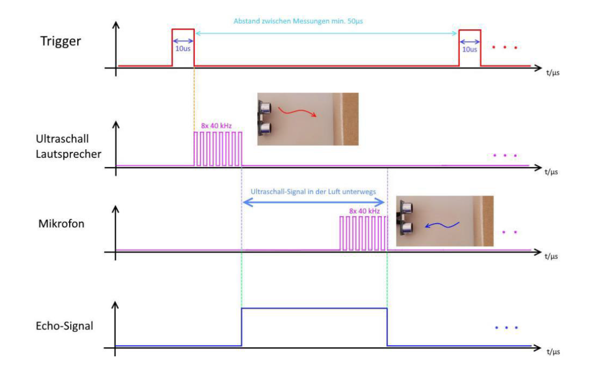

## Hindernis erkennen
Damit der Roboter Hindernisse erkennt, nutzen wir einen Ultraschall-Sensor. 

Die Messung wird gestartet durch:
```C
    digitalWrite(<ABSTAND_TRIGGER>, HIGH);
    delayMicroseconds(10);
    digitalWrite(<ABSTAND_TRIGGER>, LOW);
    Time = pulseIn(DISTANCEECHO, HIGH); // Receive Signal
    Distance = (Time/2)*0.03432; // Distance in cm
```

{:.info}
Der Pin `ABSTAND_TRIGGER` gibt einen Ultrschallton aus, ist also ein _OUTPUT_. Das Mikrofon `DISTANCEECHO`, zeichnet die Länge auf, die der Schall nachläuft, wenn der Ton nicht mehr generiert wird. Es mus daher als _INPUT_ initialisiert werden. 

Füge anschließend den Hindernis-Sensor zum Programm hinzu. Der Roboter soll in keinem Fahrmodus (Licht oder Linie Folgen) mit einem Hindernis kollidieren.

So sieht das Signal des Ultraschallsensors aus.



|                  |                 |
|:-------------    | -------------:  |
|<a href="./Licht-Folgen.html"><- Licht folgen</a>|<a href="./Hindernis-ueberholen.html">Hindernis überholen -></a>|