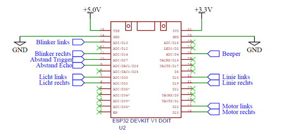

## Linie-Folgen

<span style="color: red; font-weight: bold; text-decoration: underline;">Achtung:</span>
Die Steckbrücke auf dem 2-poligen Stecker, also der Jumper muss <span style="text-decoration: underline;">immer</span> abgezogen werden, wenn der ESP32 über ein USB-Kabel mit deinem PC verbunden ist! Sind die Batterie und der ESP32 gleichzeitig an die Bauteile angeschlossen, kann das zu Problemen führen!



Obenstehend siehst du eine Abbildung der Pins des ESP32. In <span style="color: blau;">blau</span> eingezeichnet sind die einzelnen Bauteile des Roboters, verbunden mit dem jeweiligen Pins. Im Programm musst du die Pins auch entsprechend mit dem Bauteilen verknüpfen, also die Pins entsprechend definieren mit dem Befehl:
```C

#define <Bezeichnung> <PinNummer>

```
Dies ist Platinen bedingt und kann nicht geändert werden. Die Pin-Nummer ist hierbei die Zahl die <span style="text-decoration: underline;">in dem Kasten</span> steht. also bei "Blinker links - D13" ist die Pin-Nummer 13. Die Zahl außerhalb von dem Kasten ist hier nicht zu beachten.

Theoretisch ließe sich das Programm auch nur durch Pin-Nummern umsetzen, allerdings ist es mit den alternativen-Bezeichnungen viel übersichtlicher.

### Aufgabe 1: "Linie Folgen"
Kombiniere die verherigen Aufgaben so, dass dein Roboter einer Linie folgen kann.

Als Linie funktioniert ein dünnes, schwarzes Blebeband oder Isolierband, dass auf einem weißen Tisch im Kreis gezogen wurde.

### Aufgabe 2: "Blinken"
Nutze die LEDs auf der Platine als Blinker des Roboters. Es soll die linke LED blinken, wenn der Roboter eine Linkskurve fährt und umgekehrt.

### Aufgabe 3: "Hupen"
Nutze den Beeper als Hupe des Roboters. Wenn beide Liniensensoren die Farbe der Linie erkennen, soll die Hupe "betätigt werden"


|                  |                 |
|:-------------    | -------------:  |

|<a href="./Aufbauanleitung.html"><- Aufbauanleitung</a>|<a href="./Licht-folgen.html">Licht Folgen -></a>|
