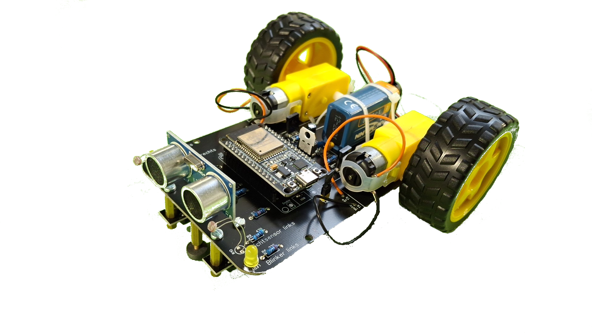

## Kurzer Überblick

Hallo und Willkommen zum Praktikum bei WAGO. In diesem Modul geht es darum, einen Linienroboter aufzubauen. Dieser kann, wie der Name vermuten lässt, einer Linie folgen.
Je nach Umfang des Praktikums können aber auch weitere Funktionen, wie das Überholen eines Hindernisses oder dem Folgen einer Taschenlampe implementiert werden.
Dazu muss der Roboter zunächst montiert und gelötet werden, um anschließend die genannten Funktionen programmieren zu können.
Bei Problemen oder Rückfragen kannst du dich gerne an unsere [Ansprechpartner](#ansprechpartner) wenden.

## Ansprechpartner

- [André Bell](mailto:Andre.Bell@wago.com)
- [Tobias Lauxtermann](mailto:Tobias.Lauxtermann@wago.com)
- [Maik Rehburg](mailto:Maik.Rehburg@wago.com)

<a href="./Einfuehrung.html">Einführung -></a>
